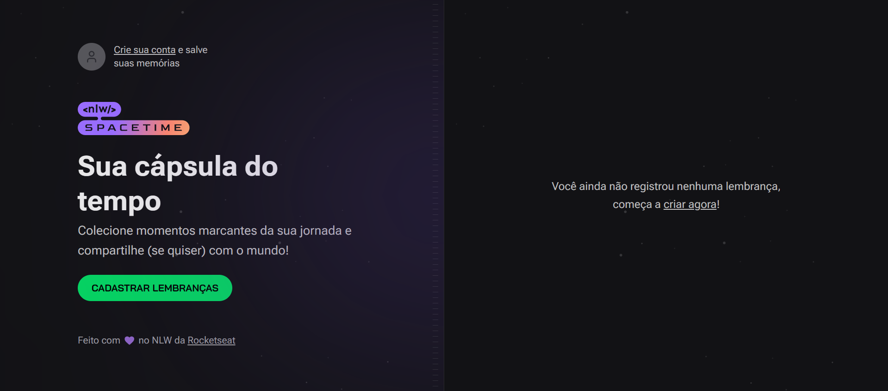
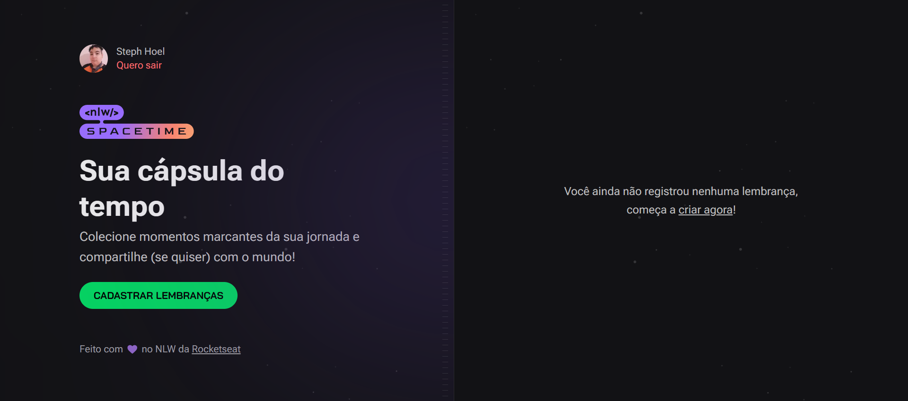
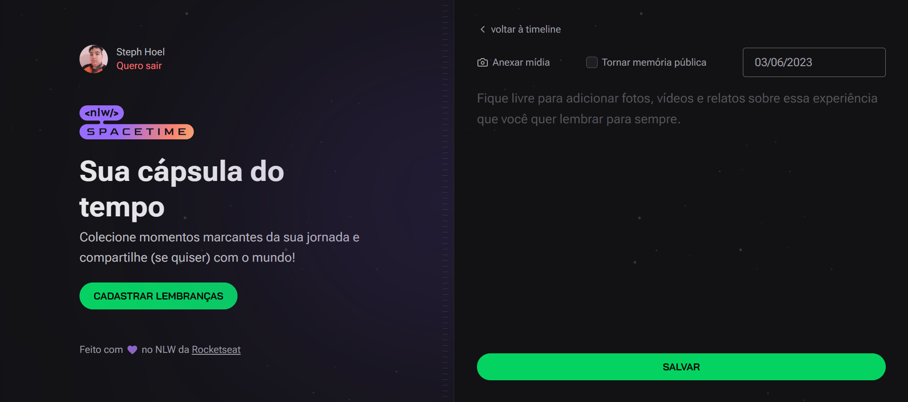
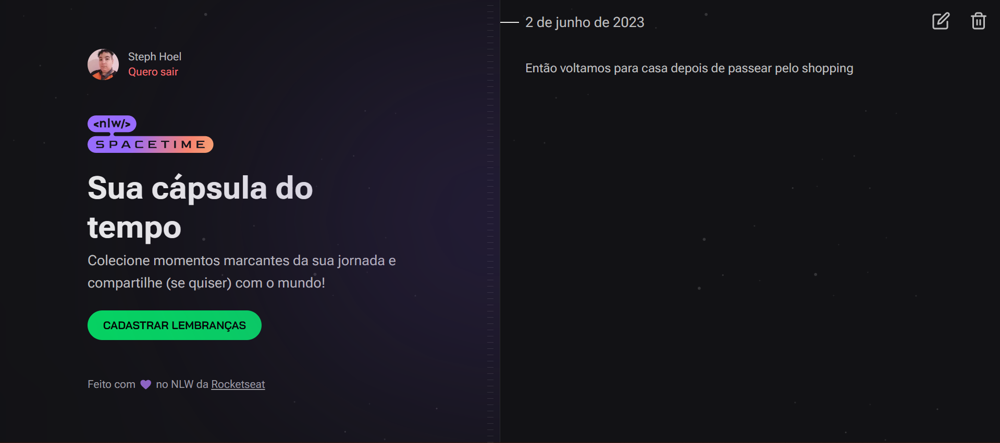
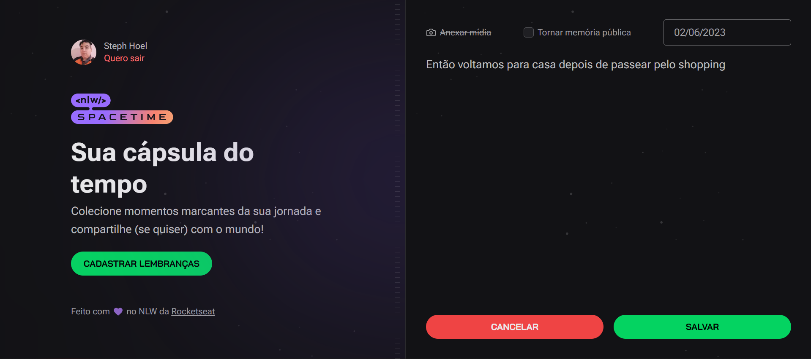
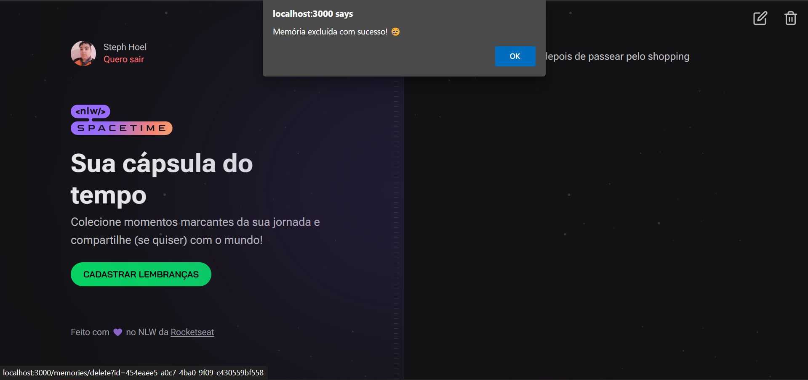

# Spacetime

This is a web and mobile application to record memories in a time capsule, where you can revisit as many times as you want to remember the most memorable moments of your life!

### Topics 

🔹 [Technologies used](#technologies-used)

🔹 [Features](#features)

🔹 [Screens](#screens)

🔹 [API Doc](#api-doc)

🔹 [Devs](#devs)

## Technologies used
- Back-end: ReactJS, Typescript, Next.js
- DataBase: Prisma, SQLite
- Front-end: ReactJS, Typescript, Tailwindcss
- Mobile: ReactNative, Expo, Typescript

## Features

- [x] [WEB] Login with Github
- [x] [WEB] Record the memory with a date chooser 
- [x] [WEB] File (image or video) upload limit to 5MB (in client and in server)
- [x] [WEB] List memories by date
- [x] [WEB] Display memories details <!-- In details page, include button for edit or delete the memory  -->
- [x] [WEB] Possibility to share a public memory (details page)
- [x] [WEB] Edit a memory
- [x] [WEB] Delete a memory

- [x] [MOBILE] Login with Github
- [x] [MOBILE] Record the memory with current date
- [ ] [MOBILE] Record the memory with a date chooser 
- [ ] [MOBILE] File (image or video) upload limit to 5MB (in client and in server)
- [ ] [MOBILE] List memories by date
- [ ] [MOBILE] Display memories details <!-- In details page, include button for edit or delete the memory  -->
- [ ] [MOBILE] Possibility to share a public memory (details page)
- [ ] [MOBILE] Edit a memory
- [ ] [MOBILE] Delete a memory

## Screens

#### Home without Login

  

#### Home with Login and no memory

  

#### Home with Login and memories

  

#### New Memory without Image loaded

  

#### New Memory with Image loaded

  

#### Detail Memory without Image 

  

#### Detail Memory with Image 

  

#### Edit Memory without Image

  

#### Edit Memory with Image

  

#### Delete Memory

  

## API Doc

Coming soon...

<!-- 
### Caminhos
| Fornecedor | (suppplier)                  |                                                |
| ---------- | ---------------------------- | ---------------------------------------------- |
| GET        | `/api/supplier`              | Retorna todos                                  |
| GET        | `/api/supplier/name/${name}` | Retorna todos que contém nome informado        |
| GET        | `/api/supplier/doc/${doc}`   | Retorna todos que contém CPNJ ou CPF informado |
| GET        | `/api/supplier/${id}`        | Retorna 1                                      |
| POST       | `/api/supplier`              | Cria                                           |
| PUT        | `/api/supplier`              | Atualiza                                       |
| DELETE     | `/api/supplier`              | Deleta                                         |

### Definição

| Parâmetro  | Tipo     | Descrição                                                            |
| ---------- | -------- | -------------------------------------------------------------------- |
| `id`       | `UUID`   | **Obrigatório**. O ID do fornecedor ou companhia que você quer       |
| `name`     | `String` | **Obrigatório**. O nome do fornecedor ou companhia que você quer     |
| `doc`      | `String` | **Obrigatório**. O CNPJ/CPF do fornecedor ou companhia que você quer |
| `usarname` | `String` | **Obrigatório**. O username que você quer verificar                  |
| `password` | `String` | **Obrigatório**. A password que você quer verificar                  |

### Schemas 

| Fornecedor                |                                                              |
| ------------------------- | ------------------------------------------------------------ |
| idSupplier                | string($uuid)                                                |
| cnpjCpfSupplier           | string                                                       |
| cnpjCpfSupplier (pattern) | `^[0-9]{2}[.]?[0-9]{3}[.]?[0-9]{3}[/]?[0-9]{4}[-]?[0-9]{2}$` |
| cnpjCpfSupplier (pattern) | `^[0-9]{3}[.]?[0-9]{3}[.]?[0-9]{3}[-]?[0-9]{2}$`             |
| isCnpjSupplier            | boolean                                                      |
| nameSupplier              | string                                                       |
| postalSupplier            | string                                                       |
| postalSupplier (pattern)  | `^[0-9]{2}[.]?[0-9]{3}[-]?[0-9]{3}$`                         |
| emailSupplier             | string                                                       |
| rgSupplier                | string                                                       |
| rgSupplier (pattern)      | `^[0-9]{2}[.]?[0-9]{3}[.]?[0-9]{3}[-]?[0-9]{1}$`             |
| birthdaySupplier          | string($date)                                                |
| createdAt                 | string($date-time)                                           |
| updatedAt                 | string($date-time)                                           |

-->

## Devs

- [Steph Hoel](https://www.github.com/StephHoel)
