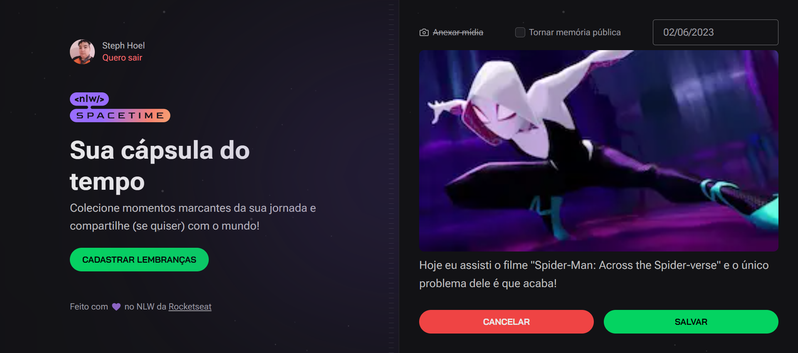

# Spacetime

This is a web and mobile application to record memories in a time capsule, where you can revisit as many times as you want to remember the most memorable moments of your life!

### Topics 

🔹 [Technologies used](#technologies-used)

🔹 [Features](#features)

🔹 [Screens WEB](#screens-web)

🔹 [API Doc](#api-doc)

🔹 [Devs](#devs)

## Technologies used
- Back-end: ReactJS, Typescript, Next.js
- DataBase: Prisma, SQLite
- Front-end: ReactJS, Typescript, Tailwindcss
- Mobile: ReactNative, Expo, Typescript

## Features

- [x] [WEB] Login with Github
- [x] [WEB] Record the memory with a date chooser 
- [x] [WEB] File (image or video) upload limit to 5MB (in client and in server)
- [x] [WEB] List memories by date
- [x] [WEB] Display memories details
- [x] [WEB] Possibility to share a public memory (details page)
- [x] [WEB] Edit a memory
- [x] [WEB] Delete a memory

- [x] [MOBILE] Login with Github
- [x] [MOBILE] Record the memory with current date
- [ ] [MOBILE] Record the memory with a date chooser 
- [ ] [MOBILE] File (image or video) upload limit to 5MB (in client and in server)
- [ ] [MOBILE] List memories by date
- [ ] [MOBILE] Display memories details <!-- In details page, include button for edit or delete the memory  -->
- [ ] [MOBILE] Possibility to share a public memory (details page)
- [ ] [MOBILE] Edit a memory
- [ ] [MOBILE] Delete a memory

## Screens WEB

#### Home without Login

  

#### Home with Login and no memory

  

#### Home with Login and memories

  

#### New Memory without Image loaded

  

#### New Memory with Image loaded

  

#### Detail Memory without Image 

  

#### Detail Memory with Image 

  

#### Edit Memory without Image

  

#### Edit Memory with Image

  

#### Delete Memory

  

## API Doc

#### Paths

| Method | Path              | Definition           |
| ------ | ----------------- | -------------------- |
| POST   | `/register`       | Register a user      |
| POST   | `/upload`         | Upload a image/video |
| GET    | `/memories`       | Return all memories  |
| GET    | `/memories/${id}` | Return a memory      |
| POST   | `/memories`       | Create a memory      |
| PUT    | `/memories/${id}` | Update a memory      |
| DELETE | `/memories/${id}` | Delete a memory      |

#### Params

| Param | Type   | Definition            |
| ----- | ------ | --------------------- |
| `id`  | `UUID` | **NEEDED** Memory ID |

#### Schemas

| User      |                    |
| --------- | ------------------ |
| id        | string($uuid)      |
| github    | int                |
| name      | string             |
| login     | string             |
| avatarUrl | string             |
| createdAt | string($date-time) |
| updatedAt | string($date-time) |

| Memory     |                    |
| ---------- | ------------------ |
| id         | string($uuid)      |
| userId     | string($uuid)      |
| coverUrl   | string             |
| content    | string             |
| isPublic   | boolean            |
| dateMemory | string($date-time) |
| createdAt  | string($date-time) |
| updatedAt  | string($date-time) |

## Devs

- [Steph Hoel](https://www.github.com/StephHoel)
